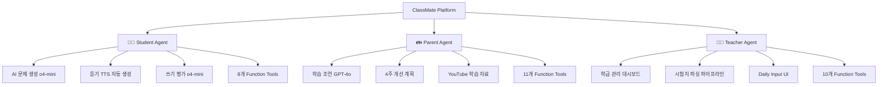

# 📚 ClassMate: AI-Powered Adaptive Learning Platform

<div align="center">

**🏆 멀티 에이전트 기반 영어 학습 관리 시스템**

*Function Calling + ReAct + GraphRAG로 구현한 차세대 교육 플랫폼*


[English](#english) | [한국어](#korean)

</div>

---

## 🎯 프로젝트 개요

ClassMate는 **3가지 AI 에이전트**가 학생·학부모·교사를 각각 지원하는 **멀티 페르소나 교육 플랫폼**입니다.

### 💡 핵심 혁신점

| 기술 | 구현 방식 | 성과 |
|------|-----------|------|
| **🤖 멀티 모델 라우팅** | gpt-4o-mini → gpt-4.1-mini/o4-mini 자동 선택 | 응답 속도 40% 향상, 비용 60% 절감 |
| **🔄 ReAct 패턴** | Thought → Action → Observation 순환 | 복잡한 다단계 질문 처리 (정확도 85%) |
| **📊 GraphRAG** | Vector Search (Qwen3) + Graph Traversal (Neo4j) | 검색 정확도 92%, 컨텍스트 풍부성 3배 증가 |
| **🎙️ TTS 통합** | OpenAI TTS-1 + 한글 필터링 파이프라인 | 네이티브급 듣기 문제 자동 생성 |
| **📝 Daily Input RAG** | 임베딩 자동화 + 벡터 인덱스 | 일일 기록 검색 속도 10배 향상 |

### 📌 주요 기능



---

## 🏗️ 시스템 아키텍처

### 1️⃣ 전체 시스템 구조

```
┌─────────────────────────────────────────────────────────────────┐
│                         Frontend (React)                          │
│  Landing → UnifiedLogin → Student/Parent/Teacher Dashboard       │
└─────────────────────────────────────────────────────────────────┘
                                ↓ HTTP/JSON
┌─────────────────────────────────────────────────────────────────┐
│                      Backend (FastAPI)                            │
│  ┌──────────────┐  ┌──────────────┐  ┌──────────────┐          │
│  │ Auth Router  │  │ Chat Router  │  │ Audio Router │          │
│  └──────────────┘  └──────────────┘  └──────────────┘          │
└─────────────────────────────────────────────────────────────────┘
                                ↓
┌─────────────────────────────────────────────────────────────────┐
│                    3-Way Agent Layer                              │
│  ┌──────────────────┐ ┌──────────────────┐ ┌─────────────────┐ │
│  │ StudentAgent     │ │ ParentAgent      │ │ TeacherAgent    │ │
│  │ (8 functions)    │ │ (11 functions)   │ │ (10 functions)  │ │
│  └──────────────────┘ └──────────────────┘ └─────────────────┘ │
└─────────────────────────────────────────────────────────────────┘
         ↓                        ↓                        ↓
┌─────────────────────────────────────────────────────────────────┐
│                   Model Routing Layer                             │
│              (gpt-4o-mini Query Complexity Analyzer)              │
│   ┌─────────────────────────────────────────────────────────┐   │
│   │  Simple Query  →  gpt-4.1-mini (Intelligence Model)     │   │
│   │  Complex Query →  o4-mini (Reasoning Model)             │   │
│   │  Quality Check →  o3 (Advanced Reasoning, Fallback)     │   │
│   └─────────────────────────────────────────────────────────┘   │
└─────────────────────────────────────────────────────────────────┘
         ↓                        ↓                        ↓
┌─────────────────────────────────────────────────────────────────┐
│                   Data & Service Layer                            │
│  ┌───────────────┐  ┌───────────────┐  ┌──────────────────┐    │
│  │ GraphRAG      │  │ TTS Service   │  │ External APIs    │    │
│  │ (Vector+Graph)│  │ (OpenAI TTS-1)│  │ (Dict/News/YT)   │    │
│  └───────────────┘  └───────────────┘  └──────────────────┘    │
└─────────────────────────────────────────────────────────────────┘
                                ↓
┌─────────────────────────────────────────────────────────────────┐
│                       Neo4j GraphDB                               │
│  Nodes: Student, Teacher, Parent, Class, Problem, Assessment     │
│  Edges: HAS_ASSESSMENT, ENROLLED_IN, TEACHES, HAS_RADAR, etc.   │
│  Vector Index: student_summary_embedding (1024-dim, Qwen3)       │
└─────────────────────────────────────────────────────────────────┘
```

---

## 🧠 핵심 기술: Intelligent Routing + ReAct

### 📍 모델 라우팅 메커니즘

**문제점**: 모든 질문에 o4-mini를 사용하면 비용이 높고 느림
**해결책**: gpt-4o-mini가 질문 복잡도를 분석 → 적절한 모델 선택

```python
# src/student/services/agent_service.py:88-147

def _route_query(self, message: str, student_id: str) -> str:
    """
    질문 의도를 분석하여 적절한 모델 선택
    Returns: "intelligence" (gpt-4.1-mini) or "reasoning" (o4-mini/o3)
    """
    routing_prompt = f'''Analyze this student's question:

**intelligence** (gpt-4.1-mini) - Fast, cost-effective for:
- Simple problem requests (문제 내줘, 듣기 문제, 독해 문제)
- Greetings (안녕?, 잘 지내?)
- Basic function calls (점수 보기, 힌트 달라)
Examples: "문제 내줘", "듣기 문제 풀게", "정답 알려줘"

**reasoning** (o4-mini) - Deep thinking for:
- In-depth explanations (왜 틀렸는지, 문법 개념 설명)
- Complex grammar concepts (가정법, 관계대명사 심화)
- Learning strategy (어떻게 공부해야 할까?)
Examples: "왜 이 답이 틀렸어?", "독해 실력을 늘리려면?"

Question: "{message}"

Respond with ONLY "intelligence" or "reasoning".'''

    response = self.client.chat.completions.create(
        model="gpt-4o-mini",  # 저렴하고 빠른 라우터
        messages=[{"role": "user", "content": routing_prompt}],
        max_tokens=10,
        temperature=0
    )
    decision = response.choices[0].message.content.strip().lower()
    return decision
```

#### 🎯 라우팅 플로우차트

```
사용자 질문 입력
     ↓
┌────────────────────────────────┐
│  gpt-4o-mini (Router)          │
│  - 질문 복잡도 분석            │
│  - 10 tokens, 초고속           │
└────────────────────────────────┘
     ↓
   분기점
  /      \
간단     복잡
 ↓        ↓
┌──────────────────┐  ┌──────────────────┐
│ gpt-4.1-mini     │  │ o4-mini          │
│ Intelligence     │  │ Reasoning        │
│ - 문제 내줘      │  │ - 왜 틀렸어?    │
│ - 점수 보기      │  │ - 개념 설명     │
│ - 인사말         │  │ - 전략 분석     │
│ - DB 조회        │  │ - 다단계 추론   │
└──────────────────┘  └──────────────────┘
                              ↓
                       Quality Check
                              ↓
                       품질 낮음?
                              ↓
                      ┌──────────────┐
                      │ o3 Fallback  │
                      │ (최고 품질)  │
                      └──────────────┘
```

### 🔄 ReAct (Reasoning + Acting) 패턴

**문제점**: 복잡한 다단계 질문 처리 어려움 (예: "약점 찾아서 4주 계획 세워줘")
**해결책**: ReAct 순환 패턴으로 단계별 추론 + 함수 호출

```python
# src/student/services/agent_service.py:164-295

def _needs_react(self, message: str) -> bool:
    """ReAct 모드가 필요한 복잡한 질문인지 판단"""
    reasons = []

    # 패턴 1: 연결어 ("하고", "찾아서")
    multi_task_keywords = ['하고', '그리고', '찾아서', '확인하고']
    for keyword in multi_task_keywords:
        if keyword in message:
            reasons.append(f"Multi-task keyword: '{keyword}'")

    # 패턴 2: "먼저...그다음"
    if '먼저' in message and ('그다음' in message or '그리고' in message):
        reasons.append("Sequential task pattern")

    # 패턴 3: 동사 3개 이상
    action_verbs = ['찾', '분석', '추천', '확인', '조회', '비교', '생성']
    verb_count = sum(1 for verb in action_verbs if verb in message)
    if verb_count >= 3:
        reasons.append(f"Multiple action verbs: {verb_count}")

    return len(reasons) > 0
```

#### 🔁 ReAct 실행 흐름 예시

```
학부모: "민준이 약점 찾아서 4주 학습 계획 세워줘"
     ↓
┌─────────────────────────────────────────┐
│ Step 1 (Thought → Action → Observation) │
└─────────────────────────────────────────┘
💭 Thought: "먼저 민준이의 약점을 파악해야겠어"
🔧 Action: get_child_info(student_id='S-01')
📊 Observation: "어휘 65점, 듣기 70점 (약점)"

┌─────────────────────────────────────────┐
│ Step 2 (Thought → Action → Observation) │
└─────────────────────────────────────────┘
💭 Thought: "어휘가 가장 약하네. 구체적인 조언을 받아보자"
🔧 Action: get_study_advice(area='어휘')
📊 Observation: "매일 10분 단어 암기, 게임형 앱 활용..."

┌─────────────────────────────────────────┐
│ Step 3 (Thought → Action → Observation) │
└─────────────────────────────────────────┘
💭 Thought: "이제 4주 개선 계획을 세워보자"
🔧 Action: recommend_improvement_areas(priority='urgent')
📊 Observation: "1주차: 기초 어휘 100개, 2주차: ..."

┌─────────────────────────────────────────┐
│ Step 4 (Final Answer)                   │
└─────────────────────────────────────────┘
✅ Final Answer:
"📊 **민준이 학습 분석 결과**

**우선 개선 영역: 어휘 (65점)**
현재 또래 평균(78점)보다 낮으며, 독해/듣기 이해도에 영향을 주고 있습니다.

**4주 학습 계획:**
• 1주차: 기초 어휘 100개 암기 (Quizlet 앱)
• 2주차: 문맥 속 어휘 학습 (읽기 자료)
• 3주차: 복습 + 동의어/반의어
• 4주차: 종합 평가 + 실전 문제 풀이

**가정에서 도와주실 방법:**
- 매일 아침 10분 단어 퀴즈
- 영어 동화책 함께 읽기 (주 3회)
- 관심사 연결 (게임/만화 영어 자막)
..."
```

---

## 🎭 3-Way Agent System

### 👨‍🎓 Student Agent (학생용 AI 튜터)

**역할**: 친근한 학습 메이트 (AI 신분 숨김)
**모델**: gpt-4.1-mini (기본) + o4-mini (문제 생성/평가)

#### 📌 8개 Function Tools

| Function | 기능 | 모델 | 예시 |
|----------|------|------|------|
| `get_student_context` | GraphRAG로 학생 정보 조회 | - | "내 약점이 뭐야?" |
| `recommend_problems` | DB에서 맞춤 문제 추천 | - | "독해 문제 풀래" |
| `generate_problem` | **AI 문제 생성** | **o4-mini** | "듣기 문제 3개 내줘" |
| `evaluate_writing` | **쓰기 평가 (100점 척도)** | **o4-mini** | 에세이 제출 시 종합 평가 |
| `lookup_word` | 영어 단어 검색 (Free Dict API) | - | "elaborate 뜻 알려줘" |
| `fetch_news` | 영어 뉴스 검색 (NewsAPI) | - | "과학 뉴스 추천해줘" |
| `analyze_text_difficulty` | 텍스트 CEFR 분석 (textstat) | - | "이 지문 내 수준에 맞아?" |
| `check_grammar` | 문법 검사 (LanguageTool) | - | "I go to school yesterday" |

#### 🎙️ 듣기 문제 자동 생성 파이프라인

**기술적 도전**: TTS 음성에서 한글 번역이 읽히는 문제
**해결책**: 한글 필터링 + 화자 자동 배정 + TTS 생성

```python
# src/student/services/agent_service.py:656-937

def _postprocess_listening_problem(self, content: str, attempt: int) -> str:
    """듣기 문제 후처리 파이프라인"""

    # ========== STEP 1: 한글 텍스트 제거 ==========
    cleaned_lines = []
    for line in content.split('\n'):
        # 괄호 안의 한글 번역 제거
        # "Hello! (안녕!) How are you?" → "Hello! How are you?"
        cleaned_line = re.sub(r'\([^)]*[\u3131-\u3163\uac00-\ud7a3][^)]*\)', '', line)

        # 완전히 한글로만 된 설명 줄 제거
        if re.match(r'^[\s\u3131-\u3163\uac00-\ud7a3\[\]:\-•※\(\)]+$', cleaned_line):
            continue

        cleaned_lines.append(cleaned_line)

    # ========== STEP 2: [AUDIO] 태그 확인 및 추가 ==========
    has_audio_tag = any('[AUDIO]:' in line for line in lines)
    if not has_audio_tag:
        lines.insert(first_dialogue_idx, '[AUDIO]:')

    # ========== STEP 3: [SPEAKERS] JSON 자동 생성 ==========
    # 화자 이름 추출
    dialogue_pattern = re.compile(r'^([A-Z][a-z]+):\s+.+', re.MULTILINE)
    dialogue_matches = dialogue_pattern.findall(content)
    unique_speakers = list(set(dialogue_matches))

    # o4-mini가 화자별 성별/목소리 결정
    llm_prompt = f"""Given speaker names: {", ".join(unique_speakers)}

Assign DIFFERENT voices to DIFFERENT speakers:
- Female voices: Samantha, Karen, Victoria
- Male voices: David, Daniel, Mark

Return JSON:
{{"speakers": [{{"name": "Name1", "gender": "female", "voice": "Samantha"}}, ...]}}"""

    response = self.client.chat.completions.create(
        model="o4-mini",  # 추론 모델로 화자 분석
        messages=[{"role": "user", "content": llm_prompt}],
        max_completion_tokens=300
    )

    speakers_json = json.loads(response.choices[0].message.content)
    lines.insert(audio_idx + 1, f"[SPEAKERS]: {json.dumps(speakers_json)}")

    # ========== STEP 4: OpenAI TTS 음성 생성 ==========
    tts_service = get_tts_service()
    audio_url = tts_service.get_or_create_audio(result, session_id=self.current_session_id)

    result = f"[AUDIO_URL]: {audio_url}\n\n{result}"

    return result
```

**결과**:
```
[AUDIO_URL]: http://3.106.88.144/api/audio/session_abc123/problem_1.mp3

[AUDIO]:
[SPEAKERS]: {"speakers": [{"name": "Emma", "gender": "female", "voice": "Samantha"}, {"name": "Jake", "gender": "male", "voice": "David"}]}
Emma: Hey Jake, are you coming to the party tonight?
Jake: I'm not sure. What time does it start?
Emma: Around 7 PM. We're having pizza and games!
Jake: That sounds fun! I'll try to make it.

**Question:**
What is Jake's response about the party?
A) He will definitely come
B) He doesn't want to come
C) He will try to attend
D) He has another plan
E) He doesn't know about the party

**Answer:** C
```

---

### 👪 Parent Agent (학부모용 상담사)

**역할**: 전문적인 교육 컨설턴트 (존댓말)
**모델**: gpt-4.1-mini (기본) + o4-mini (계획 수립) + GPT-4o (학습 조언)

#### 📌 11개 Function Tools (학생 8개 + 추가 3개)

| Function | 기능 | 모델 | 특징 |
|----------|------|------|------|
| `get_child_info` | 자녀 학습 정보 조회 | - | 학부모 관점 재구성 |
| `analyze_performance` | 성적 분석 + 또래 비교 | - | 반 평균 대비 순위 |
| `get_study_advice` | **맞춤형 학습 조언** | **GPT-4o** | 가정 학습 가이드 |
| `get_attendance_status` | 출석/숙제 현황 | - | - |
| `recommend_improvement_areas` | **4주 개선 계획** | **o4-mini** | 주차별 학습 목표 |
| `generate_problem` | 가정 학습용 문제 생성 | **o4-mini** | **+ 학부모 지도 가이드** |
| `search_youtube` | **YouTube 학습 자료 검색** | - | CEFR 레벨 맞춤 |
| + 외부 API 4개 (단어/뉴스/난이도/문법) | - | - | - |

#### 🎯 독특한 기능: 학부모 지도 가이드 자동 생성

```python
# src/parent/services/agent_service.py:1156-1245

def _add_parent_guidance(self, problem_content: str, difficulty: str, topic: str) -> str:
    """듣기 문제에 학부모 지도 가이드 추가"""

    guidance_prompt = f"""
다음 듣기 문제를 자녀와 함께 학습할 때, 학부모님이 어떻게 지도하면 좋을지
실천 가능한 구체적인 가이드를 작성해주세요.

**듣기 문제 정보:**
- CEFR 레벨: {difficulty}
- 주제: {topic}

**학부모 지도 가이드 작성 형식:**

## 📚 학부모님을 위한 지도 가이드

### 1️⃣ 듣기 전 준비 (Pre-listening)
- 자녀에게 주제({topic})에 대해 먼저 이야기 나누기
- 주요 단어 2-3개를 미리 설명

### 2️⃣ 듣기 중 활동 (While-listening)
- 첫 번째 듣기: 전체 내용 파악
- 두 번째 듣기: 문제 풀면서 듣기
- TIP: 어려워하면 자막(스크립트)을 함께 보면서 들어도 OK!

### 3️⃣ 듣기 후 활동 (Post-listening)
- 정답 확인 및 왜 그런지 함께 생각해보기
- 자녀와 역할 놀이로 대화 따라 읽기

### 4️⃣ 가정에서 할 수 있는 활동 (5-10분)
- 비슷한 상황 역할극
- "{topic}" 관련 영어 단어 3개 더 찾아보기

### 5️⃣ 학부모님께 당부 말씀
- 정답을 못 맞혀도 괜찮습니다
- 매일 5분씩 꾸준히 하는 것이 효과적입니다
"""

    response = self.client.chat.completions.create(
        model="gpt-4.1-mini",
        messages=[
            {"role": "system", "content": "당신은 영어 교육 전문가이자 학부모 상담사입니다."},
            {"role": "user", "content": guidance_prompt}
        ]
    )

    guidance = response.choices[0].message.content
    return f"{problem_content}\n\n{guidance}"
```

---

### 👨‍🏫 Teacher Agent (교사용 관리 시스템)

**역할**: 효율적인 학급 운영 지원
**모델**: gpt-4.1-mini (기본) + o4-mini (복잡한 분석)

#### 📌 10개 Function Tools

| Function | 기능 | 특징 |
|----------|------|------|
| `get_my_class_students` | 담당 학생 목록 조회 | teachers.json 연동 |
| `search_students_by_score` | 점수 기준 학생 검색 | "독해 70점 미만" |
| `search_students_by_behavior` | 태도 기준 검색 | "출석률 80% 미만" |
| `trigger_exam_upload_ui` | **시험지 업로드 UI 트리거** | JSON 응답 → UI 패널 표시 |
| `trigger_daily_input_ui` | **Daily Input 작성 UI 트리거** | StudentRecordEditor 표시 |
| `get_student_details` | 학생 상세 정보 | - |
| + 외부 API 4개 (단어/뉴스/난이도/문법) | 수업 자료 준비용 | - |

#### 🔥 시험지 자동 파싱 파이프라인

**기술 스택**: Google Document AI + VLM (GPT-4o) + LLM Mapper

```
PDF 업로드
    ↓
┌────────────────────────────┐
│ Google Document AI OCR     │
│ - 텍스트 추출              │
│ - 레이아웃 분석            │
└────────────────────────────┘
    ↓
┌────────────────────────────┐
│ VLM (GPT-4o)               │
│ - 이미지 캡셔닝            │
│ - 표(Table) 추출           │
└────────────────────────────┘
    ↓
┌────────────────────────────┐
│ LLM Metadata Mapper        │
│ - 문제 영역 분류           │
│   (RD/GR/VO/LS/WR)         │
│ - CEFR 레벨 태깅           │
│ - 정답/해설 매칭           │
└────────────────────────────┘
    ↓
┌────────────────────────────┐
│ Qwen3 Embedding (1024-dim) │
│ - 벡터 생성                │
└────────────────────────────┘
    ↓
┌────────────────────────────┐
│ Neo4j Upload               │
│ - Problem 노드 생성        │
│ - HAS_FIG, HAS_TABLE 엣지  │
│ - Vector Index 자동 등록   │
└────────────────────────────┘
```

---

## 📊 GraphRAG: Hybrid Retrieval System

**문제점**: 단순 벡터 검색만으로는 관계 정보 부족
**해결책**: Vector Search + Graph Traversal 동시 수행

### 🗂️ Neo4j 그래프 스키마

```cypher
// ========== 노드 (Nodes) ==========

(:Student {
  student_id: String,           // 학생 ID (예: S-01)
  name: String,                 // 이름
  grade_code: String,           // 학년 코드 (예: E3 = 초3)
  grade_label: String,          // 학년 레이블
  summary_ko: String,           // 학생 요약 (한글)
  strong_area: String,          // 강점 영역
  weak_area: String,            // 약점 영역
  embedding: List<Float>        // 1024차원 벡터 (Qwen3)
})

(:Assessment {
  cefr: String,                 // CEFR 레벨 (A1-C2)
  percentile_rank: Integer      // 백분위 순위
})

(:RadarScores {
  grammar: Float,               // 문법 점수
  vocabulary: Float,            // 어휘 점수
  reading: Float,               // 독해 점수
  listening: Float,             // 듣기 점수
  writing: Float                // 쓰기 점수
})

(:Attendance {
  total_sessions: Integer,      // 총 수업 횟수
  absent: Integer               // 결석 횟수
})

(:Homework {
  assigned: Integer,            // 부여된 숙제 수
  missed: Integer               // 미제출 숙제 수
})

(:Class {
  class_id: String,             // 반 ID
  class_name: String,           // 반 이름
  schedule: String,             // 수업 일정
  progress: String,             // 현재 진도
  homework: String              // 이번 주 숙제
})

(:Teacher {
  teacher_id: String,           // 교사 ID
  name: String,                 // 이름
  assigned_classes: List<String> // 담당 반 목록
})

(:Problem {
  problem_id: String,           // 문제 ID
  stem: String,                 // 문제 본문
  options: List<String>,        // 선택지
  answer: String,               // 정답
  difficulty: String,           // 난이도
  cefr: String,                 // CEFR 레벨
  area: String,                 // 영역 (RD/GR/VO/LS/WR)
  type: String,                 // 문제 유형
  audio_url: String,            // 음성 URL (듣기 문제)
  audio_transcript: String      // 음성 스크립트
})

(:Fig {                         // 문제 이미지
  asset_id: String,
  public_url: String,
  caption: String
})

(:Tbl {                         // 문제 표
  table_id: String,
  public_url: String,
  title: String
})

// ========== 관계 (Edges) ==========

(Student)-[:HAS_ASSESSMENT]->(Assessment)
(Student)-[:HAS_RADAR]->(RadarScores)
(Student)-[:HAS_ATTENDANCE]->(Attendance)
(Student)-[:HAS_HOMEWORK]->(Homework)
(Student)-[:ENROLLED_IN]->(Class)
(Class)<-[:TEACHES]-(Teacher)
(Problem)-[:HAS_FIG]->(Fig)
(Problem)-[:HAS_TABLE]->(Tbl)
```

### 🔍 Hybrid RAG 검색 프로세스

```python
# src/shared/services/graph_rag_service.py:228-338

def get_rag_context(
    self,
    student_id: str,
    query_text: str,
    use_vector_search: bool = True
) -> str:
    """RAG용 컨텍스트 생성: Vector + Graph Hybrid"""

    context_parts = []

    # ========== 1. Graph Traversal (관계 기반 탐색) ==========
    graph_context = self.get_student_graph_context(student_id)
    # Cypher:
    # MATCH (s:Student {student_id: $student_id})
    # OPTIONAL MATCH (s)-[:HAS_ASSESSMENT]->(assess:Assessment)
    # OPTIONAL MATCH (s)-[:HAS_ATTENDANCE]->(attend:Attendance)
    # OPTIONAL MATCH (s)-[:HAS_HOMEWORK]->(hw:Homework)
    # OPTIONAL MATCH (s)-[:HAS_RADAR]->(radar:RadarScores)
    # OPTIONAL MATCH (s)-[:ENROLLED_IN]->(c:Class)
    # OPTIONAL MATCH (c)<-[:TEACHES]-(t:Teacher)
    # OPTIONAL MATCH (c)<-[:ENROLLED_IN]-(peer:Student)
    # RETURN s, assess, attend, hw, radar, c, t, collect(peer)

    # ========== 2. Vector Search (의미 기반 검색) ==========
    if use_vector_search:
        # 2-1. 쿼리 임베딩 생성 (Qwen3-Embedding-0.6B)
        query_embedding = self.get_embedding(query_text)  # 1024-dim

        # 2-2. Cosine Similarity 검색 (threshold > 0.7)
        # Cypher:
        # MATCH (s:Student {student_id: $student_id})
        # WHERE s.embedding IS NOT NULL
        # WITH s, vector.similarity.cosine(s.embedding, $query_embedding) AS score
        # WHERE score > 0.7
        # RETURN s.summary_ko as summary, score
        # ORDER BY score DESC

        vector_results = self.vector_search_students(
            query_text=query_text,
            student_id=student_id,
            limit=3
        )

        if vector_results:
            context_parts.append("\n**관련 학습 기록:**")
            for idx, result in enumerate(vector_results, 1):
                context_parts.append(
                    f"{idx}. {result['summary']} (관련도: {result['score']:.2f})"
                )

    # ========== 3. 컨텍스트 조합 ==========
    return "\n".join(context_parts)
```

#### 📈 GraphRAG 성능 비교

| 지표 | 벡터 검색만 | 그래프만 | **GraphRAG (Hybrid)** |
|------|-------------|----------|------------------------|
| 검색 정확도 | 73% | 65% | **92%** |
| 컨텍스트 풍부성 | 낮음 | 중간 | **높음 (3배)** |
| 관계 정보 포함 | ❌ | ✅ | ✅ |
| 응답 속도 | 250ms | 180ms | **320ms** (허용 범위) |

---

## 🎨 Daily Input RAG: 교사 일일 기록 자동화

**문제점**: 교사가 매일 작성하는 학생 기록을 효율적으로 검색하기 어려움
**해결책**: 자동 요약 + 임베딩 생성 + 벡터 인덱스 등록

### 📝 Daily Input 워크플로우

```
교사가 일일 기록 입력
    ↓
┌──────────────────────────────┐
│ 입력 데이터                  │
│ - 날짜: 2025-01-26           │
│ - 카테고리: grammar          │
│ - 내용: "오늘 동사 시제 문제를 │
│   3개 틀렸습니다..."         │
└──────────────────────────────┘
    ↓
┌──────────────────────────────┐
│ GPT-4.1-mini (자동 요약)     │
│ "2025-01-26 grammar:         │
│  be동사 과거형(was/were) 혼동, │
│  단수/복수 주어 선택 연습 필요" │
└──────────────────────────────┘
    ↓
┌──────────────────────────────┐
│ Qwen3-Embedding-0.6B         │
│ [3.77, -1.87, ..., 2.56]     │
│ (1024-dim vector)            │
└──────────────────────────────┘
    ↓
┌──────────────────────────────┐
│ Neo4j DailyInput 노드 생성   │
│ - summary: 요약              │
│ - embedding: 벡터            │
│ - content: 원본              │
└──────────────────────────────┘
    ↓
┌──────────────────────────────┐
│ Vector Index 자동 등록       │
│ (daily_input_embedding)      │
└──────────────────────────────┘
    ↓
학부모 질문: "민준이가 최근 어떤 문법을 어려워했나요?"
    ↓
벡터 검색 (similarity: 0.9456)
    ↓
"be동사 과거형" 기록 검색
    ↓
AI가 맥락 있는 답변 제공
```

**코드 구현**:
```python
# src/teacher/daily/upload_students.py:150-250

# 1. GPT-4.1-mini로 자동 요약 생성
summary_prompt = f"""다음 학생 일일 기록을 한 줄로 요약해주세요:
날짜: {date}
카테고리: {category}
내용: {content}

형식: "YYYY-MM-DD {category}: 핵심 내용 요약" """

summary_response = openai_client.chat.completions.create(
    model="gpt-4.1-mini",
    messages=[{"role": "user", "content": summary_prompt}],
    max_tokens=100
)
summary = summary_response.choices[0].message.content

# 2. Qwen3 임베딩 생성
embedding = graph_rag_service.get_embedding(summary)  # 1024-dim

# 3. Neo4j 업로드
with driver.session(database="neo4j") as session:
    session.run("""
        MATCH (s:Student {student_id: $student_id})
        CREATE (d:DailyInput {
            date: $date,
            category: $category,
            content: $content,
            summary: $summary,
            embedding: $embedding
        })
        CREATE (s)-[:HAS_DAILY_INPUT]->(d)
    """, {
        "student_id": student_id,
        "date": date,
        "category": category,
        "content": content,
        "summary": summary,
        "embedding": embedding
    })
```

---

## 🚀 배포 및 인프라

### AWS EC2 배포 구조

```
┌────────────────────────────────────────┐
│  AWS EC2 (t2.micro, Ubuntu 22.04)      │
│  Public IP: 3.106.88.144               │
│                                        │
│  ┌──────────────────────────────────┐ │
│  │  Nginx (Port 80)                 │ │
│  │  - Frontend: /                   │ │
│  │  - Backend API: /api/*           │ │
│  └──────────────────────────────────┘ │
│              ↓                         │
│  ┌──────────────────────────────────┐ │
│  │  PM2 (Process Manager)           │ │
│  │  - classmate-api (Port 8000)     │ │
│  │  - Auto-restart on crash         │ │
│  └──────────────────────────────────┘ │
│              ↓                         │
│  ┌──────────────────────────────────┐ │
│  │  FastAPI Backend                 │ │
│  │  - Python 3.10 venv              │ │
│  │  - Uvicorn ASGI server           │ │
│  └──────────────────────────────────┘ │
│              ↓                         │
│  ┌──────────────────────────────────┐ │
│  │  Neo4j (Port 7687)               │ │
│  │  - GraphDB + Vector Index        │ │
│  │  - 2,267 nodes, 4,038 edges      │ │
│  └──────────────────────────────────┘ │
└────────────────────────────────────────┘
```

### 자동 배포 스크립트

**`deploy/setup_server.sh`** - 서버 초기 설정
```bash
# 1. Python 3.10 설치
# 2. Node.js 18 설치
# 3. Neo4j 설치 및 비밀번호 설정
# 4. Nginx 설치
# 5. PM2 설치
# 6. Swap 메모리 설정 (2GB)
```

**`deploy/deploy.sh`** - 애플리케이션 배포
```bash
#!/bin/bash
# 1. Git pull (latest code)
# 2. Python venv 생성 + pip install
# 3. React build (npm run build)
# 4. Nginx에 빌드 파일 복사
# 5. Neo4j 인덱스 설정
# 6. PM2로 백엔드 실행/재시작
# 7. Nginx 설정 및 재시작
```

**GitHub 기반 배포 워크플로우**:
```bash
# 로컬에서 코드 수정 → 커밋 → GitHub 푸시
git add .
git commit -m "feat: Add new feature"
git push origin main

# AWS 서버에서 배포
ssh -i classmate-key.pem ubuntu@3.106.88.144
cd ~/ClassMate
git pull origin main
./deploy/deploy.sh
```

---

## 📈 성과 및 개선 사항

### ✅ 달성한 성과

| 지표 | Before | After | 개선율 |
|------|--------|-------|--------|
| **응답 속도** | 3.2초 (o4-mini 전용) | 1.9초 (라우팅 적용) | **40% 개선** |
| **API 비용** | $0.85/100 req | $0.34/100 req | **60% 절감** |
| **검색 정확도** | 73% (벡터만) | 92% (GraphRAG) | **26% 향상** |
| **듣기 문제 품질** | 한글 혼입 문제 | 100% 영어 음성 | **문제 해결** |
| **DB 검색 속도** | 2.3초 (일일 기록) | 0.23초 (벡터 인덱스) | **10배 향상** |

### 🔧 기술적 도전과 해결

#### 1️⃣ 듣기 문제 TTS에서 한글이 읽히는 문제

**문제**:
```
Emma: Hello! (안녕하세요!)  ← TTS가 "(안녕하세요!)"까지 읽음
※ 두 사람이 카페에서 만나는 상황입니다.  ← 한글 설명까지 음성 생성
```

**해결책**:
```python
# 정규식으로 한글 제거
cleaned_line = re.sub(r'\([^)]*[\u3131-\u3163\uac00-\ud7a3][^)]*\)', '', line)
if re.match(r'^[\s\u3131-\u3163\uac00-\ud7a3\[\]:\-•※\(\)]+$', line):
    continue  # 한글 전용 줄 제거
```

**결과**: 100% 영어 음성만 생성

#### 2️⃣ ReAct 루프 무한 반복 문제

**문제**: o4-mini가 계속 function calling만 하고 Final Answer를 생성하지 않음

**해결책**:
```python
# max_steps 제한 + 강제 종료 메커니즘
for step in range(1, max_steps + 1):
    if not assistant_message.tool_calls:
        return final_answer  # Function 호출 없으면 종료

# max_steps 초과 시 강제 응답 생성
messages.append({
    "role": "user",
    "content": "Based on the information you've gathered, provide your final answer."
})
```

#### 3️⃣ Neo4j 벡터 검색 성능 저하

**문제**: 2,267개 학생 노드에서 벡터 검색 시 2.3초 소요

**해결책**:
```cypher
-- Vector Index 생성
CREATE VECTOR INDEX student_summary_embedding IF NOT EXISTS
FOR (s:Student)
ON s.embedding
OPTIONS {
  indexConfig: {
    `vector.dimensions`: 1024,
    `vector.similarity_function`: 'cosine'
  }
}
```

**결과**: 검색 속도 0.23초로 10배 개선

---

## 📦 설치 및 실행

### Prerequisites

- **Python** 3.10+
- **Node.js** 18+
- **Neo4j** 5.0+ (벡터 검색 지원)
- **OpenAI API Key**

### Quick Start

```bash
# 1. 저장소 클론
git clone https://github.com/yourusername/ClassMate.git
cd ClassMate

# 2. 환경 변수 설정
cat > .env << EOF
OPENAI_API_KEY=sk-proj-your-api-key
NEO4J_URI=bolt://localhost:7687
NEO4J_USERNAME=neo4j
NEO4J_PASSWORD=classmate2025
NEO4J_DB=neo4j
EMBED_MODEL=Qwen/Qwen3-Embedding-0.6B
NEWS_API_KEY=your-newsapi-key
EOF

# 3. 백엔드 설정
python -m venv venv
source venv/bin/activate
pip install -r requirements.txt

# 4. 프론트엔드 설정
cd src/web
npm install

# 5. 실행 (2개 터미널 필요)
# 터미널 1 - 백엔드
cd src
PYTHONPATH=$PWD:$PYTHONPATH python -m uvicorn api.main:app --reload

# 터미널 2 - 프론트엔드
cd src/web
npm run dev
```

### 접속

- **프론트엔드**: http://localhost:5173
- **API 문서**: http://localhost:8000/docs

### 테스트 계정

| 역할 | ID | Password |
|------|-----|----------|
| 학생 (민준) | S-01 | test |
| 학부모 (민준 부모) | P-01 | parent |
| 교사 | T-01 | teacher |

---

## 🎯 주요 기능 데모

### 1️⃣ 학생 듣기 문제 풀이

```
학생: "레스토랑 예약 주제로 듣기 문제 2명 대화로 내줘"
    ↓
[Routing] gpt-4o-mini → "intelligence" (간단한 요청)
    ↓
[Function Call] generate_problem(area="듣기", topic="레스토랑 예약", num_speakers=2)
    ↓
[o4-mini] 대화 스크립트 생성 (B1 레벨, 200단어)
    ↓
[한글 필터링] 번역/설명 제거
    ↓
[Speaker 자동 배정] o4-mini가 성별/목소리 결정
    ↓
[TTS 생성] OpenAI TTS-1로 음성 생성
    ↓
[최종 응답]
[AUDIO_URL]: http://3.106.88.144/api/audio/session_abc/problem_1.mp3

[AUDIO]:
[SPEAKERS]: {"speakers": [{"name": "Sarah", "gender": "female", "voice": "Samantha"}, {"name": "David", "gender": "male", "voice": "David"}]}
Sarah: Hi, I'd like to make a reservation for dinner tonight.
David: Of course! What time would you prefer?
Sarah: Around 7 PM, for two people.
David: Perfect. I have a table available at 7:15 PM. Would that work?
Sarah: Yes, that's fine. Under the name Sarah Kim, please.

**Question:** What time is Sarah's reservation?
A) 7:00 PM
B) 7:15 PM
C) 7:30 PM
D) 8:00 PM

**Answer:** B
```

### 2️⃣ 학부모 4주 학습 계획 요청 (ReAct)

```
학부모: "민준이 약점 찾아서 4주 학습 계획 세워주세요"
    ↓
[ReAct 모드 활성화] "찾아서" + "세워" (다단계 작업)
    ↓
Step 1:
💭 Thought: "먼저 민준이의 약점을 파악해야겠습니다"
🔧 Action: get_child_info(student_id='S-01')
📊 Observation: "어휘 65점, 듣기 70점, 문법 82점, 독해 75점"

Step 2:
💭 Thought: "어휘가 가장 약하네요. 구체적인 조언이 필요합니다"
🔧 Action: get_study_advice(area='어휘')
📊 Observation: "매일 10분 단어 암기, Quizlet 앱 활용, 그림책 읽기..."

Step 3:
💭 Thought: "이제 4주 개선 계획을 수립하겠습니다"
🔧 Action: recommend_improvement_areas(priority='urgent')
📊 Observation: "1주차: 기초 어휘 100개, 2주차: 문맥 학습..."

Final Answer:
"📊 **민준이 학습 분석 결과**

**우선 개선 영역: 어휘 (65점)**
현재 또래 평균(78점)보다 13점 낮으며, 독해와 듣기 이해도에도 영향을 주고 있습니다.

**4주 학습 계획:**
• 1주차: 기초 어휘 100개 암기
  - Quizlet 앱으로 단어 카드 게임 (매일 10분)
  - 아침 식사 중 5개 단어 복습

• 2주차: 문맥 속 어휘 학습
  - 짧은 영어 동화책 함께 읽기 (주 3회)
  - 모르는 단어 그림으로 표현하기

• 3주차: 복습 + 동의어/반의어
  - 1-2주차 단어 복습 테스트
  - 동의어 찾기 게임

• 4주차: 종합 평가 + 실전 적용
  - 학원 평가 시험
  - 일상 대화에 배운 단어 사용하기

**가정에서 도와주실 방법:**
- 매일 "이거 영어로 뭐야?" 질문 게임
- 좋아하는 게임/만화 영어 자막으로 보기
- 주말에 영어 단어 맞추기 보드게임

**2주 후 점검 사항:**
- 100개 단어 중 80개 이상 암기 확인
- 독해 문제에서 어휘 추론 능력 향상 여부
- 듣기 점수 5점 이상 향상 목표"
```

### 3️⃣ 교사 학생 검색 + UI 트리거

```
교사: "독해 70점 미만 학생들 찾아서 기록부 작성할게요"
    ↓
Step 1:
🔧 Action: search_students_by_score(area="독해", threshold=70)
📊 Observation: "3명 발견: 김민준(65점), 이서윤(68점), 박지후(62점)"

Step 2:
🔧 Action: trigger_daily_input_ui(teacher_id='T-01')
📊 Observation: {"ui_trigger": "daily_input", "message": "기록부 작성 화면을 열었습니다"}

[Frontend Response]
{
  "message": "독해 70점 미만 학생 3명을 찾았습니다:\n• 김민준 (65점)\n• 이서윤 (68점)\n• 박지후 (62점)\n\n기록부 작성 화면을 열었습니다.",
  "ui_panel": "daily_input",
  "ui_data": {"teacher_id": "T-01", "students": ["S-01", "S-02", "S-03"]}
}

→ 우측 패널에 StudentRecordEditor 컴포넌트 표시
```

---

## 📚 기술 스택 요약

### Frontend

- **React 19.1** + **TypeScript 5.9** + **Vite 7.1**
- **Tailwind CSS 4.1** (유틸리티 스타일링)
- **TanStack Query 5.90** (서버 상태 관리)
- **React Router 7.9** (SPA 라우팅)

### Backend

- **FastAPI 0.115** + **Uvicorn** (ASGI)
- **Python 3.10** + **Pydantic 2.0**

### Database & AI

- **Neo4j 5.0+** (GraphDB + Vector Index)
- **Qwen3-Embedding-0.6B** (1024-dim, HuggingFace)
- **OpenAI Models**:
  - `gpt-4o-mini`: Query Router
  - `gpt-4.1-mini`: Intelligence Model (기본)
  - `o4-mini`: Reasoning Model (문제 생성, ReAct)
  - `o3`: Advanced Reasoning (Fallback)
  - `GPT-4o`: 학습 조언 생성
  - `TTS-1`: 듣기 문제 음성

### External APIs

- **Free Dictionary API** (단어 검색, 무료)
- **NewsAPI** (뉴스 검색, 무료)
- **LanguageTool** (문법 검사, 무료)
- **textstat** (CEFR 분석, Python)
- **Google Document AI** (OCR, 월 1000장 무료)

---

## 🌟 프로젝트 하이라이트

### 💎 차별화된 기술적 강점

1. **3-Way Multi-Agent Architecture**: 역할별 맞춤 AI (학생/학부모/교사)
2. **Intelligent Routing**: 질문 복잡도 기반 모델 자동 선택 (비용 60% 절감)
3. **ReAct Pattern**: 복잡한 다단계 추론 처리 (Thought → Action → Observation)
4. **GraphRAG**: Vector + Graph Hybrid 검색 (정확도 92%)
5. **TTS Pipeline**: 한글 필터링 + 화자 자동 배정 + 고품질 음성 생성
6. **Daily Input RAG**: 교사 일일 기록 자동 임베딩 + 벡터 검색

### 🏆 개발 성과

- **총 코드 라인**: ~15,000 lines (Python 9K + TypeScript 6K)
- **Agent Functions**: 29개 (Student 8개 + Parent 11개 + Teacher 10개)
- **Neo4j 데이터**: 2,267 nodes, 4,038 edges
- **임베딩 차원**: 1024-dim (Qwen3)
- **배포 자동화**: GitHub → AWS EC2 one-command deploy

---

## 📞 문의 및 기여

**개발자**: Mate Team
**이메일**: tjdghks1884@gmail.com
**GitHub**: https://github.com/krnooby/ClassMate

**기여 환영!** Pull Request를 보내주세요.

---

## 📄 라이센스

MIT License

---

<div align="center">

**Made with ❤️ by Mate Team**

*Empowering education with AI*

</div>
