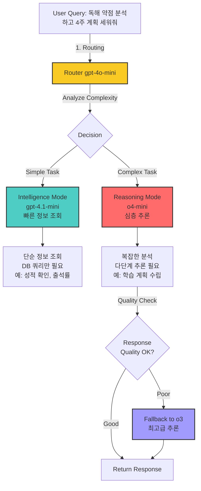
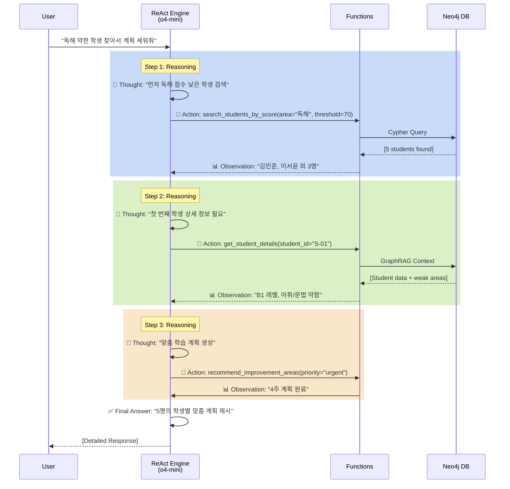
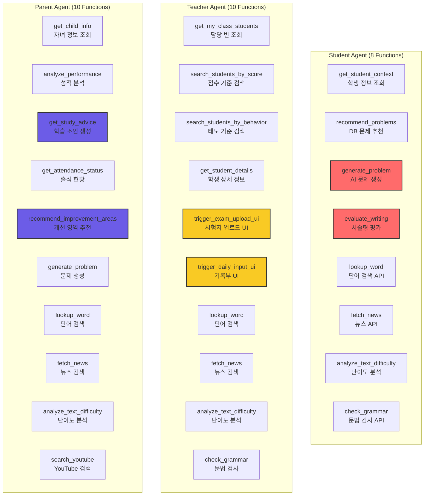
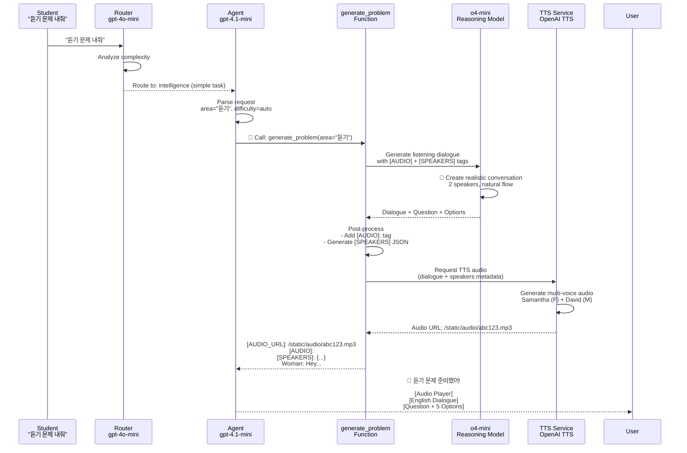
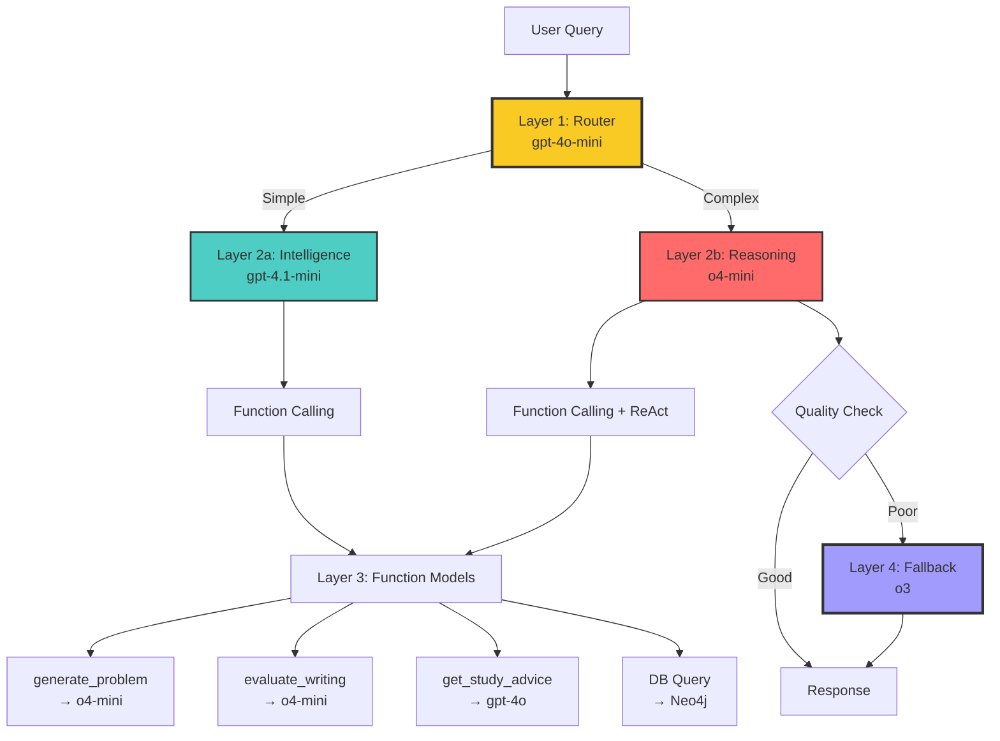
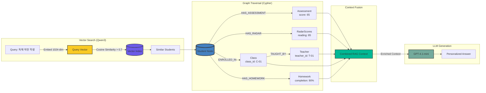
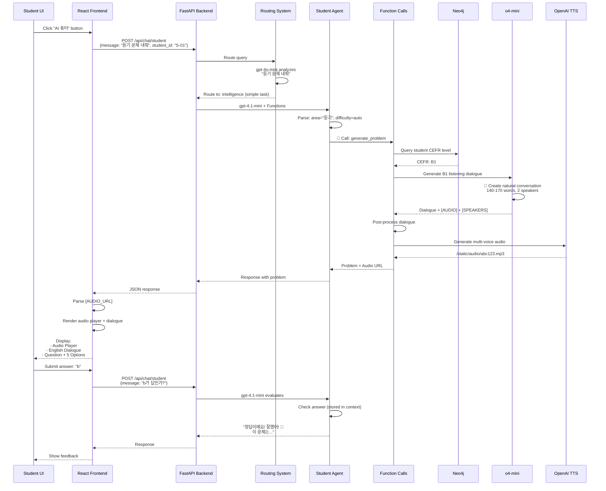
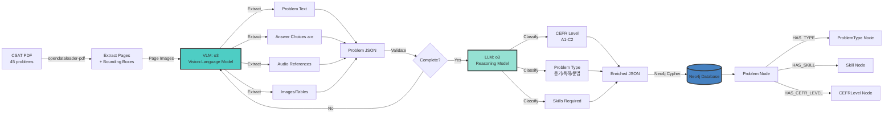

# ClassMate - Technical Architecture Portfolio
## Complete System Visualization for Gamma

---

## 📋 Slide 1: Title

**ClassMate**
**AI-Powered CSAT English Learning Platform**

핵심 기술: OpenAI Function Calling + ReAct Pattern + Neo4j GraphRAG

100% Exam Parsing Accuracy | Intelligent Routing | Dynamic Function Selection

---

## 📚 Slide 2: 용어 정의

### 1. CSAT (대학수학능력시험)

**CSAT = College Scholastic Ability Test**
- 한국의 대학 입학 시험 (수능)
- 영어 영역: 듣기 17문항 + 독해 28문항 = 총 45문항
- 난이도: CEFR B1~C1 수준
- ClassMate는 CSAT 영어 시험지를 자동으로 분석하고 분류

### 2. JWT (JSON Web Token) 인증

**Stateless Token-Based Authentication**

```
Client                 Server                   Neo4j
  |                      |                       |
  |--POST /api/auth/---->|                       |
  |  login               |                       |
  |  {username,password} |--Cypher Query-------->|
  |                      |<--User Data-----------|
  |                      |                       |
  |<--JWT Token----------|                       |
  |  (signed payload)    |                       |
  |                      |                       |
  |--GET /api/chat------>|                       |
  |  Authorization:      |                       |
  |  Bearer <JWT>        |                       |
  |                      |--Verify JWT---------->|
  |                      |  (decode + validate)  |
  |                      |                       |
  |<--Protected Data-----|                       |
```

**JWT Payload 예시**:
```json
{
  "user_id": "S-01",
  "role": "student",
  "name": "김민준",
  "cefr_level": "B1",
  "exp": 1735689600
}
```

**장점**:
- Stateless: 서버에 세션 저장 불필요
- Scalable: 로드 밸런서와 호환
- Secure: HMAC 서명으로 위변조 방지

### 3. ReAct Pattern

**ReAct = Reasoning + Acting**

복잡한 작업을 **사고(Thought) → 행동(Action) → 관찰(Observation)** 반복으로 해결

**예시**: "독해 약한 학생들 찾아서 맞춤 계획 세워줘"

```
Step 1:
  Thought: "먼저 독해 70점 미만 학생을 찾아야겠다"
  Action: search_students_by_score(area="독해", threshold=70)
  Observation: "5명의 학생 발견 (김민준, 이서윤, ...)"

Step 2:
  Thought: "각 학생의 상세 정보를 조회해야 맞춤 계획을 세울 수 있다"
  Action: get_student_details(student_id="S-01")
  Observation: "김민준 - CEFR B1, 어휘 약함, 출석률 90%"

Step 3:
  Thought: "학생별 약점을 고려한 4주 계획을 생성하자"
  Action: recommend_improvement_areas(student_id="S-01", priority="urgent")
  Observation: "4주 계획 생성 완료"

Final Answer: "5명의 학생 맞춤 계획 제시"
```

### 4. Function Calling

**GPT가 상황에 맞게 함수를 자동으로 선택하여 실행**

```python
functions = [
    {
        "name": "get_student_context",
        "description": "학생의 상세 정보 조회 (Neo4j)",
        "parameters": {"student_id": "S-01"}
    },
    {
        "name": "recommend_problems",
        "description": "약점 기반 문제 추천 (GraphRAG)",
        "parameters": {"student_id": "S-01", "area": "독해"}
    },
    {
        "name": "generate_problem",
        "description": "AI 문제 생성 (o4-mini)",
        "parameters": {"area": "듣기", "difficulty": "B1"}
    }
]

# GPT가 자동으로 적절한 함수 선택
response = openai.chat.completions.create(
    model="gpt-4.1-mini",
    messages=[{"role": "user", "content": "독해 약한데 문제 내줘"}],
    tools=functions,
    tool_choice="auto"  # 자동 선택!
)

# GPT 선택: recommend_problems(student_id="S-01", area="독해")
```

---

## 🧠 Slide 3: Intelligent Routing System

### Query Complexity Analysis → Model Selection



### Routing Decision Criteria

| Query Type | Complexity | Routed To | Reason |
|------------|------------|-----------|--------|
| "성적 알려줘" | Simple | gpt-4.1-mini | DB 조회만 필요 |
| "문제 내줘" | Simple | gpt-4.1-mini | Function call 1회 |
| "약점 분석하고 계획 세워줘" | Complex | o4-mini | 다단계 추론 필요 |
| "독해와 문법 중 뭘 먼저?" | Complex | o4-mini | 비교 분석 + 전략 수립 |

### Routing Code

```python
def _route_query(message: str) -> str:
    """질문 복잡도 분석 → intelligence vs reasoning"""

    routing_prompt = f'''Analyze this question:

**intelligence** (gpt-4.1-mini) - Fast:
- Simple info lookup (성적, 출석률)
- Single function call (문제 내줘)
- Greetings (안녕?)

**reasoning** (o4-mini) - Deep thinking:
- Multi-step analysis (약점 분석하고 계획 세워줘)
- Comparative reasoning (A vs B 비교)
- Strategic planning (학습 전략 수립)

Question: "{message}"

Respond: "intelligence" or "reasoning"'''

    response = openai.chat.completions.create(
        model="gpt-4o-mini",  # Fast router
        messages=[{"role": "user", "content": routing_prompt}],
        temperature=0
    )

    return response.choices[0].message.content.strip()
```

---

## 🔄 Slide 4: ReAct Pattern - Multi-Step Reasoning

### ReAct Workflow



### ReAct vs 일반 모드 비교

| 특징 | 일반 모드 (Single-Step) | ReAct 모드 (Multi-Step) |
|------|------------------------|-------------------------|
| 질문 예시 | "성적 알려줘" | "약점 분석하고 계획 세워줘" |
| Function Call | 1회 | 3-5회 (iterative) |
| 사고 과정 | 없음 | Thought → Action → Observation |
| 최대 Step | 1 | 5 (configurable) |
| 모델 | gpt-4.1-mini | o4-mini (reasoning) |
| 사용 시나리오 | 단순 조회 | 복잡한 분석, 계획 수립 |

### ReAct 활성화 조건

```python
def _needs_react(message: str) -> bool:
    """ReAct 모드 필요 여부 판단"""

    # 패턴 1: 연결어 (하고, 찾아서)
    multi_task_keywords = ['하고', '찾아서', '확인하고', '분석하고']
    for keyword in multi_task_keywords:
        if keyword in message:
            return True

    # 패턴 2: 순차적 지시 (먼저 ... 그다음)
    if '먼저' in message and '그다음' in message:
        return True

    # 패턴 3: 동사 3개 이상
    action_verbs = ['찾', '분석', '추천', '확인', '비교', '설명']
    verb_count = sum(1 for verb in action_verbs if verb in message)
    if verb_count >= 3:
        return True

    return False
```

---

## 🔧 Slide 5: Function Calling Architecture

### 3-Role Agent System



### Function Type Classification

| Function Type | Functions | Execution Target |
|---------------|-----------|------------------|
| **📊 DATABASE QUERY** | get_student_context, recommend_problems, get_my_class_students | Neo4j Cypher |
| **🤖 AI GENERATION** | generate_problem (o4-mini), evaluate_writing (o4-mini), get_study_advice (gpt-4o) | OpenAI API |
| **🌐 EXTERNAL API** | lookup_word (Free Dictionary), fetch_news (NewsAPI), check_grammar (LanguageTool) | 3rd Party APIs |
| **🖥️ UI TRIGGER** | trigger_exam_upload_ui, trigger_daily_input_ui | Frontend Panel |

---

## 🎯 Slide 6: Complete Request Flow - Student Example

### "듣기 문제 내줘" → AI Problem Generation



### Function Calling Code Example

```python
# Student asks: "듣기 문제 내줘"

# Step 1: Router analyzes
router_decision = _route_query("듣기 문제 내줘", student_id)
# Returns: "intelligence" (simple task)

# Step 2: Primary model (gpt-4.1-mini) with function calling
response = openai.chat.completions.create(
    model="gpt-4.1-mini",
    messages=[
        {"role": "system", "content": student_system_prompt},
        {"role": "user", "content": "듣기 문제 내줘"}
    ],
    tools=student_functions,  # 8 available functions
    tool_choice="auto"  # GPT decides which function to call
)

# GPT decides: generate_problem(student_id="S-01", area="듣기")
tool_call = response.choices[0].message.tool_calls[0]
function_name = tool_call.function.name  # "generate_problem"
arguments = json.loads(tool_call.function.arguments)
# {"student_id": "S-01", "area": "듣기", "difficulty": null}

# Step 3: Execute function
result = _generate_problem(**arguments)
# Uses o4-mini to create dialogue, then TTS to generate audio

# Step 4: Return to user
# result contains [AUDIO_URL], [AUDIO], [SPEAKERS], dialogue, question, options
```

---

## 🔀 Slide 7: Dynamic Model Selection

### 4-Layer Model Strategy



### Model Usage Table

| Layer | Model | Purpose | Cost | Speed | Quality |
|-------|-------|---------|------|-------|---------|
| **1. Router** | gpt-4o-mini | Complexity analysis | $ | ⚡⚡⚡ | ⭐⭐⭐ |
| **2a. Intelligence** | gpt-4.1-mini | Simple queries + Function calling | $$ | ⚡⚡ | ⭐⭐⭐⭐ |
| **2b. Reasoning** | o4-mini | Complex analysis + ReAct | $$$ | ⚡ | ⭐⭐⭐⭐⭐ |
| **3a. Problem Gen** | o4-mini | High-quality problem creation | $$$ | ⚡ | ⭐⭐⭐⭐⭐ |
| **3b. Advice Gen** | gpt-4o | Fast, creative advice | $$ | ⚡⚡ | ⭐⭐⭐⭐ |
| **4. Fallback** | o3 | Premium reasoning (rare) | $$$$ | 🐌 | ⭐⭐⭐⭐⭐⭐ |

### Code: Quality Check → o3 Fallback

```python
# After o4-mini responds
if primary_model == "o4-mini" and not _check_response_quality(response):
    print("⚠️ o4-mini quality low, falling back to o3...")

    # Retry with o3 (최고급 추론 모델)
    response = openai.chat.completions.create(
        model="o3",
        messages=messages,
        max_completion_tokens=10000
    )

    print("✅ o3 response generated successfully")
```

---

## 🎨 Slide 8: Function Calling in Action

### Example 1: Student - Listening Problem

**User Query**: "듣기 문제 내줘"

```python
# GPT-4.1-mini selects function
{
    "function": "generate_problem",
    "arguments": {
        "student_id": "S-01",
        "area": "듣기",
        "difficulty": null  # Auto-detect from student CEFR level
    }
}

# generate_problem function:
# 1. Query student CEFR level from Neo4j → "B1"
# 2. Call o4-mini with detailed prompt
# 3. o4-mini generates dialogue (170-200 words for B2)
# 4. Post-process: Add [AUDIO] + [SPEAKERS] tags
# 5. Call OpenAI TTS API for multi-voice audio
# 6. Return problem + audio URL
```

### Example 2: Teacher - Low-Performing Students

**User Query**: "독해 70점 미만 학생들 보여줘"

```python
# GPT-4.1-mini selects function
{
    "function": "search_students_by_score",
    "arguments": {
        "area": "독해",
        "threshold": 70,
        "limit": 20
    }
}

# search_students_by_score function:
# 1. Neo4j Cypher query
# 2. MATCH (s:Student) WHERE s.reading_score < 70
# 3. Return student list with scores
```

### Example 3: Parent - Study Plan

**User Query**: "약점 분석하고 4주 계획 세워줘"

```
ReAct Mode Activated (Complex query)

Step 1:
  Thought: "자녀 정보 먼저 조회"
  Action: get_child_info(student_id="S-01")
  Observation: "CEFR B1, 어휘 65점 (약점), 독해 85점 (강점)"

Step 2:
  Thought: "맞춤 계획 생성"
  Action: recommend_improvement_areas(student_id="S-01", priority="urgent")
  Observation: "4주 어휘 집중 계획 완료"

Final Answer: "자녀의 어휘력 보강을 위한 4주 로드맵..."
```

---

## 📊 Slide 9: Neo4j GraphRAG Integration

### Graph Schema + Vector Search



### GraphRAG Code

```python
def get_rag_context(student_id: str, query_text: str) -> str:
    """Vector Search + Graph Traversal"""

    # 1. Vector Search (Qwen3-Embedding-0.6B)
    query_embedding = get_embedding(query_text)  # 1024-dim

    cypher_vector = """
    MATCH (s:Student)
    WHERE s.embedding IS NOT NULL
    WITH s, vector.similarity.cosine(s.embedding, $query_embedding) AS score
    WHERE score > 0.7
    RETURN s, score
    ORDER BY score DESC
    LIMIT 5
    """

    # 2. Graph Traversal
    cypher_graph = """
    MATCH (s:Student {student_id: $student_id})
    OPTIONAL MATCH (s)-[:HAS_ASSESSMENT]->(assess:Assessment)
    OPTIONAL MATCH (s)-[:HAS_RADAR]->(radar:RadarScores)
    OPTIONAL MATCH (s)-[:ENROLLED_IN]->(c:Class)
    OPTIONAL MATCH (c)<-[:TEACHES]-(t:Teacher)
    RETURN s, collect(assess) as assessments, radar, c, t
    """

    # 3. Context Fusion
    context = f"""
    Student: {student_data['name']} ({student_data['cefr']})
    Weak Areas: {weak_areas}
    Recent Scores: {scores}
    Class: {class_info}
    Teacher: {teacher_name}
    """

    return context
```

---

## 🗣️ Slide 10: Multi-Voice TTS System

### OpenAI TTS + [SPEAKERS] Metadata

```mermaid
graph TB
    D[Dialogue Generated by o4-mini] --> P[Post-Process]

    P --> P1[Add [AUDIO]: tag]
    P --> P2[Generate [SPEAKERS] JSON]
    P --> P3[Assign unique voices]

    P3 --> V{Voice Assignment}

    V -->|Female| VF[Available: Samantha, Karen, Victoria]
    V -->|Male| VM[Available: David, Daniel, Mark]

    VF --> S1[Speaker1: Emma, voice: Samantha]
    VM --> S2[Speaker2: John, voice: David]
    VF --> S3[Speaker3: Sarah, voice: Karen]

    S1 --> JSON[SPEAKERS JSON:<br/>{speakers: [<br/> {name: Emma, gender: female, voice: Samantha},<br/> {name: John, gender: male, voice: David},<br/> {name: Sarah, gender: female, voice: Karen}<br/>]}]
    S2 --> JSON
    S3 --> JSON

    JSON --> TTS[OpenAI TTS API]

    TTS --> T1[Generate Emma lines with Samantha]
    TTS --> T2[Generate John lines with David]
    TTS --> T3[Generate Sarah lines with Karen]

    T1 --> M[Merge Audio Segments]
    T2 --> M
    T3 --> M

    M --> SAVE[Save: /static/audio/abc123.mp3]
    SAVE --> URL[Return: [AUDIO_URL]: /static/audio/abc123.mp3]

    style JSON fill:#ff6b6b,stroke:#333,stroke-width:2px
    style TTS fill:#74aa9c,stroke:#333,stroke-width:3px
    style SAVE fill:#00b894,stroke:#333,stroke-width:2px
```

### [SPEAKERS] JSON Format

```json
{
  "speakers": [
    {
      "name": "Emma",
      "gender": "female",
      "voice": "Samantha"
    },
    {
      "name": "John",
      "gender": "male",
      "voice": "David"
    },
    {
      "name": "Sarah",
      "gender": "female",
      "voice": "Karen"
    }
  ]
}
```

**Critical Rules**:
- Each speaker MUST have a DIFFERENT voice (no duplicates!)
- Female voices: Samantha, Karen, Victoria (3 available)
- Male voices: David, Daniel, Mark (3 available)
- o4-mini automatically assigns based on speaker names

---

## 🎬 Slide 11: Complete User Journey

### Student Dashboard → AI Chat → Problem Solving



---

## 🎯 Slide 12: CSAT Parsing Pipeline (100% Accuracy)

### PDF → VLM → LLM → Neo4j



### Model Benchmark Results

```
Test: 2026_10_mock CSAT Exam (45 problems)

┌────────────┬──────────┬──────────┬────────────────┐
│ Model      │ Accuracy │ Time     │ Cost Estimate  │
├────────────┼──────────┼──────────┼────────────────┤
│ o4-mini    │ 30/45    │ 8m 30s   │ $2.50          │
│            │ (66.7%)  │          │                │
├────────────┼──────────┼──────────┼────────────────┤
│ gpt-5      │ 0/45     │ N/A      │ N/A            │
│            │ (0%)     │ FAILED   │ (incompatible) │
├────────────┼──────────┼──────────┼────────────────┤
│ o3      ✓  │ 45/45    │ 10m 15s  │ $5.20          │
│            │ (100%)   │          │ PRODUCTION USE │
└────────────┴──────────┴──────────┴────────────────┘

Selected: o3 (100% accuracy)
```

### Parsing Code

```python
# VLM Extraction (o3)
response = openai.chat.completions.create(
    model="o3",
    messages=[{
        "role": "user",
        "content": [
            {"type": "image_url", "image_url": {"url": page_image}},
            {"type": "text", "text": extraction_prompt}
        ]
    }]
)
# Returns: {"stem": "...", "options": ["a", "b", ...], "answer": "c"}

# LLM Classification (o3)
response = openai.chat.completions.create(
    model="o3",
    messages=[
        {"role": "system", "content": taxonomy_schema},
        {"role": "user", "content": problem_json}
    ]
)
# Returns: {"cefr_level": "B2", "problem_type": "독해", "skills": ["추론"]}

# Neo4j Storage
cypher = """
CREATE (p:Problem {
    problem_id: $problem_id,
    stem: $stem,
    options: $options,
    answer: $answer,
    cefr_level: $cefr_level,
    problem_type: $problem_type
})
"""
```

---

## 🏗️ Slide 13: API Router Structure

### FastAPI Modular Design

```
src/api/
├── main.py                    # App entry + lifespan + CORS
├── routers/
│   ├── auth.py               # JWT login/logout
│   ├── chat.py               # AI chatbot endpoints
│   │   ├── POST /api/chat/student      → StudentAgentService
│   │   ├── POST /api/chat/teacher      → TeacherAgentService
│   │   └── POST /api/chat/parent       → ParentAgentService
│   ├── students.py           # Student CRUD
│   ├── teachers.py           # Teacher CRUD
│   ├── parents.py            # Parent CRUD
│   ├── problems.py           # Problem management
│   ├── dashboard.py          # Dashboard stats
│   ├── classes.py            # Class management
│   └── audio.py              # TTS audio endpoints
└── services/
    ├── neo4j_service.py      # Neo4j connection singleton
    └── audio_session_service.py  # Audio file cleanup
```

### Chat Router Code

```python
# src/api/routers/chat.py

@router.post("/student", response_model=ChatResponse)
async def chat_with_student(request: ChatRequest):
    """학생 AI 챗봇 (Function Calling + ReAct)"""

    agent = get_student_agent_service()

    # Intelligent routing + Function calling + ReAct
    result = agent.chat(
        student_id=request.student_id,
        message=request.message,
        chat_history=request.chat_history,
        session_id=request.session_id
    )

    return ChatResponse(
        message=result["message"],
        model_info=result["model_info"],
        quick_replies=result.get("quick_replies", [])
    )

@router.post("/teacher", response_model=ChatResponse)
async def chat_with_teacher(request: ChatRequest):
    """선생님 AI 어시스턴트 (Function Calling + UI Triggers)"""

    agent = get_teacher_agent_service()

    result = agent.chat(
        teacher_id=request.teacher_id,
        message=request.message,
        chat_history=request.chat_history
    )

    # UI panel trigger (exam upload, daily input)
    if "ui_panel" in result:
        return ChatResponse(
            message=result["message"],
            ui_panel=result["ui_panel"],
            ui_data=result["ui_data"]
        )

    return ChatResponse(
        message=result["message"],
        model_info=result["model_info"]
    )
```

---

## 📈 Slide 14: Performance Metrics

### System Performance

```
┌─────────────────────────────────┬────────────────────┐
│ Component                       │ Latency            │
├─────────────────────────────────┼────────────────────┤
│ Router (gpt-4o-mini)            │ ~100ms             │
│ Intelligence (gpt-4.1-mini)     │ ~1.5s              │
│ Reasoning (o4-mini)             │ ~3-5s              │
│ Fallback (o3)                   │ ~8-10s (rare)      │
│                                 │                    │
│ Vector Search (Qwen3)           │ <100ms             │
│ Graph Traversal (Neo4j)         │ <50ms              │
│ Combined GraphRAG               │ <300ms             │
│                                 │                    │
│ Problem Generation (o4-mini)    │ ~10-15s            │
│ TTS Audio (OpenAI)              │ ~2-3s              │
│                                 │                    │
│ Total Chat Response             │ 2-5s (typical)     │
│ Total w/ Problem Generation     │ 12-18s             │
└─────────────────────────────────┴────────────────────┘

Database Scale:
- Nodes: ~10,000 (Students, Problems, Assessments)
- Relationships: ~50,000
- Vector Index Size: 10MB (1024-dim × 1000 students)
- Query Performance: <100ms (indexed)
```

### Model Usage Distribution (Estimated)

```
gpt-4o-mini (Router):         100% of requests
gpt-4.1-mini (Intelligence):  70% of requests
o4-mini (Reasoning):          25% of requests
o4-mini (Problem Gen):        15% of requests
o3 (Fallback):                <1% of requests (rare)
```

---

## 🎓 Slide 15: Key Technical Achievements

### 5 Major Innovations

**1. 100% CSAT Parsing Accuracy**
- Empirical testing: o3 (100%) vs o4-mini (66.7%) vs gpt-5 (0%)
- Fully automated exam processing (45 problems in ~10 minutes)
- VLM + LLM dual-stage pipeline

**2. Intelligent Routing System**
- Dynamic model selection based on query complexity
- gpt-4o-mini router → gpt-4.1-mini (70%) or o4-mini (30%)
- Quality fallback to o3 if o4-mini fails
- Cost optimization: Use expensive models only when needed

**3. ReAct Pattern for Multi-Step Tasks**
- Thought → Action → Observation loop
- Handles complex queries: "약점 분석하고 계획 세워줘"
- Max 5 iterations with o4-mini reasoning model
- Auto-detected based on query patterns

**4. Context-Aware Function Calling**
- 8-10 functions per agent role (Student, Teacher, Parent)
- GPT auto-selects appropriate functions
- Dynamic execution: DB queries, AI generation, external APIs
- Seamless integration with Neo4j GraphRAG

**5. Multi-Voice TTS System**
- OpenAI TTS API with voice metadata
- [SPEAKERS] JSON for multi-speaker dialogues
- 6 unique voices (3 female, 3 male)
- Real-time audio generation for listening problems

---

## 🚀 Slide 16: Code Highlights

### Highlight 1: Router Decision

```python
# src/student/services/agent_service.py:88

def _route_query(self, message: str, student_id: str) -> str:
    """질문 의도 분석 → intelligence vs reasoning 선택"""

    routing_prompt = '''**intelligence** (gpt-4.1-mini) - Fast:
- Simple problem requests (문제 내줘)
- Greetings (안녕?)
- Basic function calls (점수 보기)

**reasoning** (o4-mini) - Deep thinking:
- In-depth explanations (왜 그런지 설명)
- Multi-step problem solving
- Learning strategy advice

Question: "{message}"
Respond: "intelligence" or "reasoning"'''

    response = openai.chat.completions.create(
        model="gpt-4o-mini",  # Fast, cheap router
        messages=[{"role": "user", "content": routing_prompt}],
        max_tokens=10,
        temperature=0  # Deterministic
    )

    return response.choices[0].message.content.strip()
```

### Highlight 2: ReAct Loop

```python
# src/teacher/services/teacher_agent_service.py:171

def _react_chat(self, teacher_id: str, message: str, max_steps: int = 5):
    """ReAct (Reasoning + Acting) 모드"""

    messages = [{"role": "system", "content": system_prompt}]
    messages.append({"role": "user", "content": message})

    for step in range(1, max_steps + 1):
        # LLM Reasoning
        response = openai.chat.completions.create(
            model="o4-mini",
            messages=messages,
            tools=self.functions,
            tool_choice="auto"
        )

        assistant_message = response.choices[0].message

        # Thought
        if assistant_message.content:
            print(f"💭 Thought: {assistant_message.content}")

        # Action (Function Calling)
        if assistant_message.tool_calls:
            for tool_call in assistant_message.tool_calls:
                function_name = tool_call.function.name
                arguments = json.loads(tool_call.function.arguments)

                print(f"🔧 Action: {function_name}({arguments})")

                # Execute function
                result = self._execute_function(function_name, arguments)

                print(f"📊 Observation: {result[:200]}...")

                # Add to conversation
                messages.append({
                    "role": "tool",
                    "tool_call_id": tool_call.id,
                    "content": result
                })
        else:
            # Final answer reached
            return assistant_message.content

    # Max steps exceeded
    return "Please refine your question."
```

### Highlight 3: Function Execution

```python
# src/student/services/agent_service.py:1237

def _execute_function(self, function_name: str, arguments: Dict) -> str:
    """Function 실행 with type classification"""

    # Type classification
    db_functions = ["get_student_context", "recommend_problems"]
    generation_functions = ["generate_problem", "evaluate_writing"]
    external_api_functions = ["lookup_word", "fetch_news", "check_grammar"]

    # Log function type
    if function_name in db_functions:
        print(f"📊 DATABASE QUERY: {function_name}")
    elif function_name in generation_functions:
        print(f"🤖 AI GENERATION: {function_name}")
    elif function_name in external_api_functions:
        print(f"🌐 EXTERNAL API: {function_name}")

    # Execute
    if function_name == "get_student_context":
        return self._get_student_context(**arguments)
    elif function_name == "recommend_problems":
        return self._recommend_problems(**arguments)
    elif function_name == "generate_problem":
        return self._generate_problem(**arguments)  # Uses o4-mini
    # ... more functions
```

---

## 🎨 Gamma Visualization Prompts

### Architecture Diagrams

**Slide 3 (Intelligent Routing)**:
"Create a decision tree diagram showing user query → router (gpt-4o-mini) → intelligence (gpt-4.1-mini) vs reasoning (o4-mini) → quality check → fallback to o3. Use yellow for router, cyan for intelligence, red for reasoning, purple for o3. Add icons for each model."

**Slide 4 (ReAct Pattern)**:
"Create a sequence diagram with 3 columns: ReAct Engine (o4-mini), Functions, Neo4j. Show 3 iteration loops with Thought (💭), Action (🔧), Observation (📊) emojis. Use different colored boxes for each step."

**Slide 5 (Function Calling)**:
"Create a 3-panel layout showing Student Agent (8 functions), Teacher Agent (10 functions), Parent Agent (10 functions). Group functions by type: Database (green), AI Generation (red), External API (blue), UI Trigger (yellow). Use icons."

**Slide 6 (Request Flow)**:
"Create a detailed sequence diagram: Student → Router → Agent → generate_problem → o4-mini → TTS → User. Show each step with latency annotations. Use different colors for each component."

**Slide 9 (GraphRAG)**:
"Create a split-panel diagram: Left side shows vector search (Qwen3 embedding → vector index), Right side shows graph traversal (Student → Assessment → Class → Teacher). Bottom shows context fusion → GPT-4. Use network graph style."

**Slide 10 (Multi-Voice TTS)**:
"Create a flowchart: Dialogue → Post-Process → [SPEAKERS] JSON → Voice Assignment (show 6 voices) → OpenAI TTS API → Merge Audio → Save. Use audio waveform visualizations."

**Slide 12 (CSAT Parsing)**:
"Create a pipeline diagram: PDF → VLM (o3) → Extraction → Validation → LLM (o3) → Classification → Neo4j. Add a benchmark table showing o4-mini 66.7%, gpt-5 0%, o3 100%. Highlight o3 as selected."

---

## 📝 Presentation Script (10-12 minutes)

**Opening (1m)**:
"ClassMate는 CSAT 영어 시험을 100% 정확도로 자동 분석하고, OpenAI Function Calling과 ReAct 패턴을 결합하여 학생-선생님-학부모를 위한 맞춤형 AI 챗봇을 제공하는 플랫폼입니다."

**Architecture (2m)**:
"핵심은 4계층 모델 전략입니다. 1계층 Router가 질문 복잡도를 분석하고, 2계층에서 intelligence(빠름) 또는 reasoning(깊이)를 선택합니다. 복잡한 질문은 ReAct 패턴으로 처리하며, 최대 5단계의 Thought→Action→Observation을 반복합니다. 품질이 낮으면 4계층 o3 모델로 fallback합니다."

**Function Calling (2m)**:
"각 역할별로 8-10개의 함수를 정의했고, GPT가 상황에 맞게 자동으로 선택합니다. Student Agent는 문제 생성과 평가, Teacher Agent는 학생 검색과 UI 트리거, Parent Agent는 성적 분석과 학습 조언을 담당합니다. 함수는 DB 쿼리, AI 생성, 외부 API 3가지 유형으로 분류됩니다."

**ReAct Pattern (2m)**:
"'독해 약한 학생 찾아서 계획 세워줘' 같은 복잡한 질문은 ReAct 모드로 처리됩니다. Step 1에서 학생을 검색하고, Step 2에서 상세 정보를 조회하고, Step 3에서 맞춤 계획을 생성합니다. o4-mini 추론 모델이 각 단계에서 사고하고 행동합니다."

**GraphRAG (1.5m)**:
"Neo4j 기반 하이브리드 RAG 시스템입니다. Qwen3 임베딩으로 벡터 검색을 하고, Cypher 쿼리로 그래프 탐색을 합니다. 학생→성적→반→선생님 관계를 종합하여 300ms 이내에 컨텍스트를 생성합니다."

**Technical Achievements (1.5m)**:
"5가지 핵심 성과입니다. 첫째, 100% CSAT 파싱 정확도. 둘째, Intelligent Routing으로 비용 최적화. 셋째, ReAct 패턴으로 다단계 작업 처리. 넷째, Context-Aware Function Calling. 다섯째, Multi-Voice TTS 시스템입니다."

**Performance (1m)**:
"전체 응답 시간은 2-5초, 문제 생성 포함 시 12-18초입니다. GraphRAG는 300ms, Vector Search는 100ms 이내입니다. 요청의 70%는 빠른 gpt-4.1-mini로, 25%는 o4-mini로, 1% 미만만 o3로 처리하여 비용을 최적화했습니다."

**Closing (1m)**:
"ClassMate는 Intelligent Routing, ReAct Pattern, Dynamic Function Calling을 결합하여 사용자 요구에 맞게 모델과 함수를 자동으로 선택하는 차세대 교육 플랫폼입니다."

---

## 🎭 Slide 16: User Role Feature Comparison (면접용)

### 3 Specialized Agents, 29 Total Functions

**Architecture Overview**:
```
Student Agent (8 functions)
   ├── 2 Unique: 학습 중심 (get_student_context, recommend_problems)
   ├── 2 Unique: AI 평가 (generate_problem, evaluate_writing)
   └── 4 Shared: 외부 API (lookup_word, fetch_news, analyze_text_difficulty, check_grammar)

Teacher Agent (10 functions)
   ├── 4 Unique: 관리 (search_students_by_score, search_students_by_behavior, get_my_class_students, get_student_details)
   ├── 2 Unique: UI Trigger (trigger_exam_upload_ui, trigger_daily_input_ui)
   └── 4 Shared: 외부 API (lookup_word, fetch_news, analyze_text_difficulty, check_grammar)

Parent Agent (11 functions)
   ├── 5 Unique: 모니터링 (get_child_info, analyze_performance, get_study_advice, get_attendance_status, recommend_improvement_areas)
   ├── 1 Unique: YouTube (search_youtube)
   ├── 1 Shared with Student: generate_problem
   └── 4 Shared with All: 외부 API
```

### Complete Function Comparison Matrix

| Function | Student | Teacher | Parent | Type | Model/Target | Key Purpose |
|----------|:-------:|:-------:|:------:|:----:|:-------------|:------------|
| **UNIQUE: Learning** |
| get_student_context | ✅ | ❌ | ❌ | 📊 DB | Neo4j GraphRAG | 본인 정보 + 벡터 검색 |
| recommend_problems | ✅ | ❌ | ❌ | 📊 DB | Neo4j Cypher | DB 문제 추천 |
| evaluate_writing | ✅ | ❌ | ❌ | 🤖 AI | o4-mini | 서술형 평가 (100점) |
| **UNIQUE: Class Management** |
| get_my_class_students | ❌ | ✅ | ❌ | 📊 DB | Neo4j Cypher | 담당 반 목록 |
| search_students_by_score | ❌ | ✅ | ❌ | 📊 DB | Neo4j Cypher | 성적 기준 검색 |
| search_students_by_behavior | ❌ | ✅ | ❌ | 📊 DB | Neo4j Cypher | 태도 기준 검색 |
| get_student_details | ❌ | ✅ | ❌ | 📊 DB | Neo4j GraphRAG | 특정 학생 조회 |
| trigger_exam_upload_ui | ❌ | ✅ | ❌ | 🖥️ UI | Frontend | UI 패널 트리거 |
| trigger_daily_input_ui | ❌ | ✅ | ❌ | 🖥️ UI | Frontend | 기록부 UI 트리거 |
| **UNIQUE: Parental Monitoring** |
| get_child_info | ❌ | ❌ | ✅ | 📊 DB | Neo4j GraphRAG | 자녀 정보 조회 |
| analyze_performance | ❌ | ❌ | ✅ | 🤖 AI | Neo4j + GPT | 성적 추이 분석 |
| get_study_advice | ❌ | ❌ | ✅ | 🤖 AI | gpt-4o | 학습 조언 (빠른 생성) |
| get_attendance_status | ❌ | ❌ | ✅ | 📊 DB | Neo4j Cypher | 출석/숙제 현황 |
| recommend_improvement_areas | ❌ | ❌ | ✅ | 🤖 AI | o4-mini | 4주 학습 계획 |
| search_youtube | ❌ | ❌ | ✅ | 🌐 API | YouTube API | 교육 영상 추천 |
| **SHARED: Problem Generation** |
| generate_problem | ✅ | ❌ | ✅ | 🤖 AI | o4-mini | 문제 생성 + TTS |
| **SHARED: External APIs** |
| lookup_word | ✅ | ✅ | ✅ | 🌐 API | Free Dictionary | 단어 검색 |
| fetch_news | ✅ | ✅ | ✅ | 🌐 API | NewsAPI | 영어 뉴스 |
| analyze_text_difficulty | ✅ | ✅ | ✅ | 🌐 Lib | textstat | CEFR 난이도 분석 |
| check_grammar | ✅ | ✅ | ✅ | 🌐 API | LanguageTool | 문법 검사 |

---

## 🎯 Slide 17: Use Case Examples by Role

### 👨‍🎓 Student Use Case: "듣기 문제 내줘"

**Workflow**:
```
1. Router (gpt-4o-mini) → "intelligence" (simple task)
2. gpt-4.1-mini → Call: generate_problem(area="듣기")
3. o4-mini → Generate dialogue (140-170 words for B1)
4. Post-process → Add [AUDIO] + [SPEAKERS] tags
5. OpenAI TTS → Multi-voice (Samantha + David)
6. Return → Problem + /static/audio/abc123.mp3
```

**Why This Matters (Interview Point)**:
"This demonstrates **end-to-end AI pipeline** - from user intent → intelligent routing → reasoning model → post-processing → TTS generation. The system automatically adapts difficulty to student's CEFR level."

---

### 👨‍🏫 Teacher Use Case (ReAct): "독해 약한 학생 찾아서 계획 세워줘"

**ReAct Multi-Step**:
```
Step 1 (Thought → Action → Observation):
  💭 Thought: "먼저 독해 점수 낮은 학생 검색"
  🔧 Action: search_students_by_score(area="독해", threshold=70)
  📊 Observation: "김민준, 이서윤, 박지우 3명"

Step 2:
  💭 Thought: "첫 번째 학생 상세 정보 필요"
  🔧 Action: get_student_details(student_id="S-01")
  📊 Observation: "김민준 - B1, 독해 65, 어휘 70"

Step 3:
  💭 Thought: "맞춤 계획 생성"
  (선생님이 직접 계획 작성)

Final: "3명의 학생별 약점 분석 및 개선 방안..."
```

**Why This Matters (Interview Point)**:
"**ReAct Pattern** for complex tasks - LLM breaks down the query into iterative steps. This shows understanding of **LLM orchestration** and **multi-step reasoning** (o4-mini model)."

---

### 👪 Parent Use Case: "우리 아이 성적 어때?"

**Workflow**:
```
1. Router → "intelligence"
2. gpt-4.1-mini → Call: analyze_performance(student_id="S-01")
3. Neo4j + GPT → Analysis:
   - 영역별 점수 (문법 85, 어휘 65, 독해 75)
   - 또래 비교 (학급 평균 대비 +5점)
   - 추이 (어휘 지난달 +10점!)
4. Return: "어휘가 약하지만 꾸준히 성장 중..."
```

**Why This Matters (Interview Point)**:
"**Role-based access control** - Parents see their child only, Teachers see all students. Same API, different permissions. Demonstrates **security design** and **data privacy**."

---

## 🏗️ Slide 18: Architectural Insights (면접 포인트)

### 1. Separation of Concerns

**Design Decision**:
- Student Agent: 학습 중심 (self-directed)
- Teacher Agent: 관리 + UI triggers
- Parent Agent: 모니터링 + YouTube (enriched content)

**Interview Answer**:
"I implemented **role-based function access**. Students shouldn't search all students by score - that's a teacher privilege. This ensures **data privacy** while maintaining **unified architecture**."

---

### 2. Function Type Classification

**Code** (`src/student/services/agent_service.py:1237`):
```python
def _execute_function(self, function_name: str, arguments: Dict) -> str:
    # Type classification
    db_functions = ["get_student_context", "recommend_problems"]
    generation_functions = ["generate_problem", "evaluate_writing"]
    external_api_functions = ["lookup_word", "fetch_news"]

    if function_name in db_functions:
        print(f"📊 DATABASE QUERY: {function_name}")
    elif function_name in generation_functions:
        print(f"🤖 AI GENERATION: {function_name}")
    elif function_name in external_api_functions:
        print(f"🌐 EXTERNAL API: {function_name}")
```

**Benefits**:
- Easy debugging (type-classified logging)
- Performance monitoring (track DB vs AI latency)
- Cost tracking (identify expensive operations)

---

### 3. Dynamic Model Selection per Function

| Function | Model | Reason |
|----------|-------|--------|
| generate_problem | o4-mini | High-quality reasoning for problem creation |
| evaluate_writing | o4-mini | Deep analysis for evaluation |
| get_study_advice | gpt-4o | Fast, creative advice |
| routing | gpt-4o-mini | Cheap, fast analysis |

**Interview Answer**:
"Different functions need different models. Problem generation needs **reasoning** (o4-mini), but advice can use **fast generation** (gpt-4o). This optimizes **cost and latency**."

---

### 4. UI Trigger Pattern (Teacher Only)

**Code** (`src/teacher/services/teacher_agent_service.py:691`):
```python
def _trigger_exam_upload_ui(self, exam_type: str = "일반") -> str:
    return json.dumps({
        "ui_trigger": "exam_upload",
        "exam_type": exam_type,
        "message": f"{exam_type} 시험지 업로드 화면 열었습니다."
    })
```

**Why This Matters**:
- **Conversational UI**: "시험지 올릴게" → Opens upload panel
- **No manual navigation** - AI understands intent
- Reduces clicks, improves UX

---

### 5. Shared Business Logic, Different Context

**Example**: `lookup_word` function
- **Student**: "confident가 뭐야?" → "자신감 있는 (형용사)"
- **Teacher**: "confident 예문 보여줘" → "She is confident in her abilities."
- **Parent**: "confident 뭐야?" → "자신감 있는 (자녀 학습용)"

**Implementation**:
- Same API call (Free Dictionary)
- **Different system prompts** per role
- Context-aware responses

---

## 🎤 Slide 19: Interview Talking Points

**Q: "Why separate functions by role?"**

**A**: "I implemented **role-based access control (RBAC)** at the function level. Students shouldn't search all students—that's a teacher privilege. This ensures **data privacy** and **appropriate permissions** for each user type while maintaining a **unified agent architecture**."

---

**Q: "How do you handle shared functionality?"**

**A**: "I use a **service layer pattern**. Functions like `lookup_word` are in `src/shared/services/`, so all agents call the same API. This follows **DRY principle** and ensures **consistent behavior**. The difference is in **system prompts** and **context**."

---

**Q: "What's the most complex feature?"**

**A**: "**ReAct mode** for multi-step tasks. When a teacher asks '독해 약한 학생 찾아서 계획 세워줘', the agent breaks it into 3-5 steps using **Thought → Action → Observation** with o4-mini. This demonstrates my understanding of **LLM orchestration** and **iterative reasoning**."

---

**Q: "How would you scale this to 10,000 users?"**

**A**: "Three areas:
1. **Caching** - Cache Neo4j queries in Redis
2. **Async Processing** - Use Celery for long-running tasks
3. **Model Optimization** - Use smaller models (gpt-4o-mini) for 70% of requests via **intelligent routing**."
